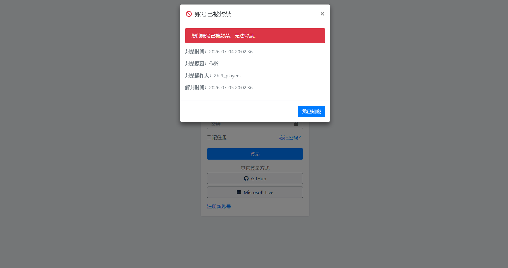

# User Ban

`user-ban` 插件用于 Blessing Skin 后台管理中对普通用户进行封禁与解封，支持永久封禁和按天封禁，并在登录或页面访问时检测封禁状态。

## 截图

## 功能

- 管理员后台管理页面封禁/解封用户
- 支持永久封禁和指定天数封禁
- 封禁用户后阻止其登录
- 封禁状态页面提示可选择弹窗或 alert 模式
- 已登录用户访问时定期检查封禁状态，若被封禁则强制登出并提示
- 封禁原因可留空，默认使用“违反规定”

## 安装

1. 将插件压缩包上传至服务端。
2. 加载插件。

## 使用

- 管理界面路由：`/admin/user-ban`
- 封禁检查 API：`/api/user-ban/check`

管理员打开后台页面后，点击“封禁”按钮即可选择封禁时长或永久封禁。

如果封禁原因留空，后台会自动使用默认原因：`违反规定`。

## 配置

插件当前支持以下配置项：

- 封禁提示样式：`modal` 或 `alert`

可在插件设置页面中选择封禁提示样式。

## 语言

插件支持中英文语言包，默认文本保存在 `lang/zh_CN` 与 `lang/en` 中。

## 注意

- 插件只对普通用户生效，管理员用户（`admin` / `super-admin`）不能被封禁。
- 如果你希望封禁在所有请求周期中生效，建议将插件的封禁检查中间件注册到 `web` 中间件组。
